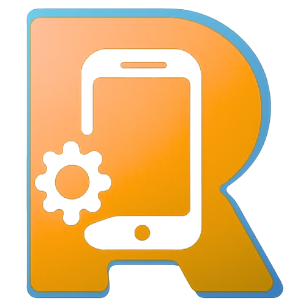

# Rentix 🚀

> **Sewa Aman, Pakai Nyaman.** — Platform marketplace penyewaan gadget dan peralatan event terpercaya.



## Tentang Rentix

Rentix adalah platform marketplace penyewaan gadget dan peralatan penunjang event (laptop, kamera, proyektor, drone, handy talky, gimbal, dan mikrofon) yang mempertemukan penyewa dengan pemilik barang secara fleksibel, mulai dari sewa harian hingga bulanan.

## Fitur Utama

- 🔍 **Browse & Filter** — Temukan gadget berdasarkan kategori, harga, rating, dan ketersediaan
- 📦 **Detail Produk** — Galeri, spesifikasi lengkap, dan booking card interaktif
- 🛒 **Keranjang** — Ringkasan pesanan dengan kalkulasi asuransi otomatis
- 📝 **Sewakan Barangmu** — Form pendaftaran produk untuk pemilik
- 🔐 **E-KYC Verification** — Verifikasi identitas aman via biometrik
- 🛡️ **Rentix Protection** — Asuransi otomatis 5% per transaksi
- 🗑️ **Data Wipe Protocol** — Privasi terjamin setelah sewa selesai

## Tech Stack

- **React 18** + **Vite**
- **React Router DOM v6** — Client-side routing
- **Zustand** — State management (cart, wishlist, modal, toast)
- **CSS Modules** — Component-scoped styling
- **Google Fonts** — Inter & Outfit

## Project Structure

```
src/
├── components/     # Navbar, Footer, ProductCard, Toast, Modal
├── pages/          # Home, Browse, Detail, Cart, ListItem, HowItWorks, Login, Register
├── data/           # Product catalog & categories
├── store/          # Zustand global store
└── index.css       # Global styles & CSS variables
public/
└── logo.png + product images
```

## Getting Started

```bash
# Install dependencies
npm install

# Start dev server
npm run dev

# Build for production
npm run build
```

## Halaman Tersedia

| Route | Halaman |
|---|---|
| `/` | Beranda (Home) |
| `/browse` | Jelajahi Produk |
| `/product/:id` | Detail Produk |
| `/cart` | Keranjang |
| `/list-item` | Sewakan Barangmu |
| `/how-it-works` | Cara Kerja |
| `/login` | Masuk |
| `/register` | Daftar |

---

Made with ❤️ for Rentix — Sewa Aman, Pakai Nyaman.
